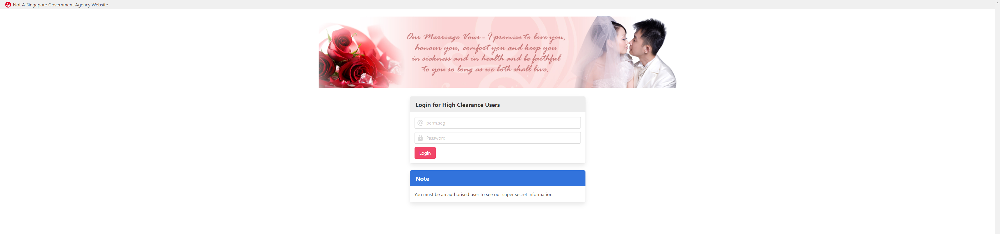
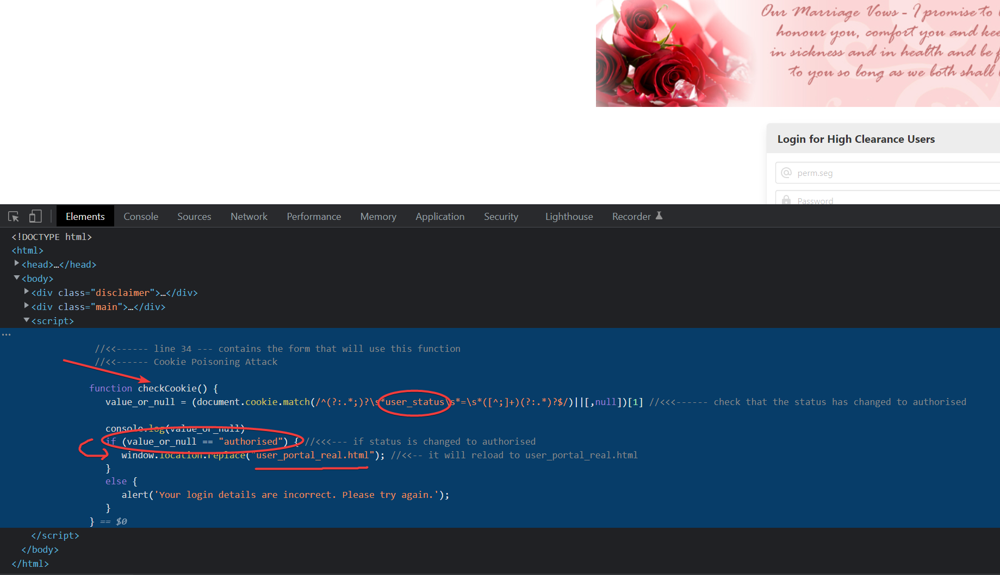
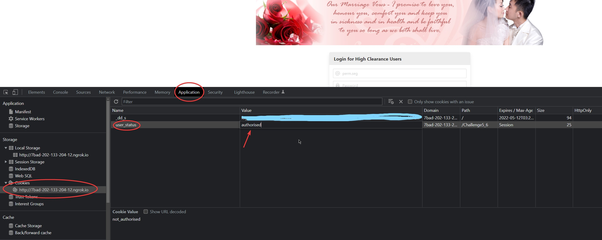
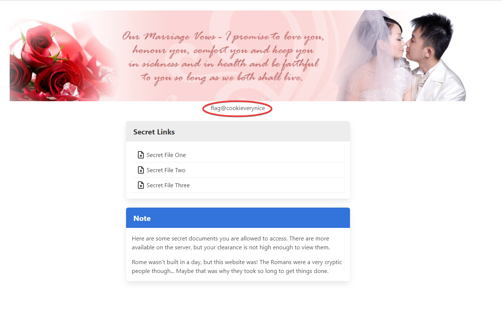

# CookiePoisoning | Difficulty: Easy

## Requirements:

- Basic knowledge of web development 
    - Viewing page source
    - Base understanding of JS snytax
- Knowledge of viewing and editing cookies for a website

---

## Steps:

1. View the `page source` of the website.

    You will notice that the method of authentication for logging in is checking of `cookies`.

    

    If the value of the cookie `user_status` is `authorised` then the real webpage will be loaded.

2. View and edit the cookie `user_status`.

    If you are using `Chrome`, you can view and edit cookies using the inbuilt cookie editor.
    
    You can find this editor by going to `View Page Source -> Application -> Storage -> Cookies`.\
    Next, select the webpage from the dropdown list.\
    Next, select the cookie named "user_status", right-click and select "Edit value".\
    Lastly, enter in the new value of "authorised". Make sure that you type it in exactly.

    

3. Press Login and you're in!

    

---
EXTRA\
If you had noticed in Step (1), you can actually go to the webpage directly by visiting the subdomain `user_portal_real.html`.\
However that would defeat the purpose of this CTF Challenge which is about attack through the poisoning of cookies. :P