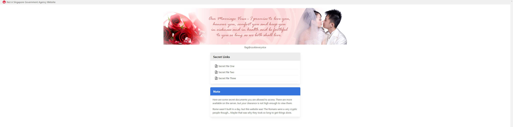
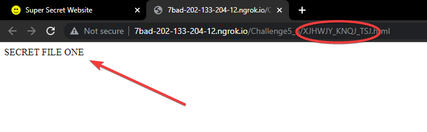
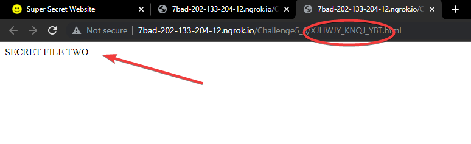
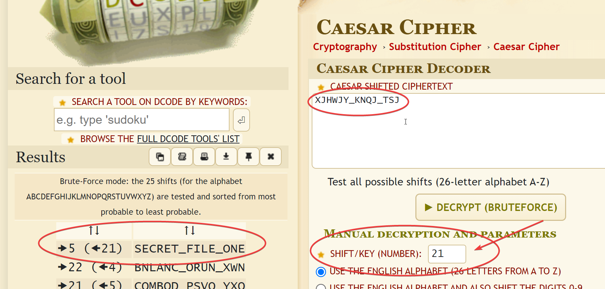
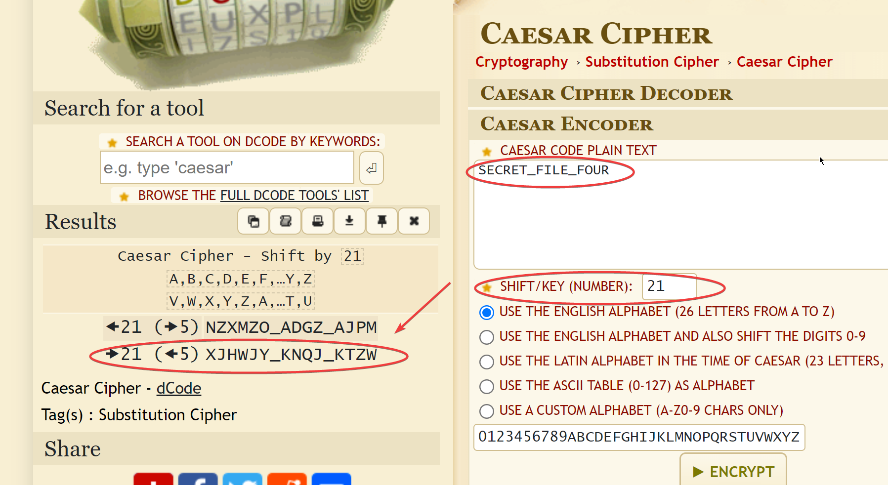
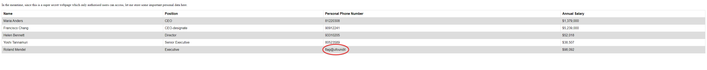

# DirectObjectReferencing | Difficulty: Medium

## Requirements:

- Knowledge of Caesar Cipher

---

## Steps:

1.  Try opening one of the secret files from "Secret Links".

    
    

2.  Notice that both subdomains start with `XJHWJY_KNQJ_`.

    `XJHWJY` has the same number of characters as SECRET.\
    `KNQJ` also has the same number of characters as FILE.

    It is likely that subdomains referencing is of the format:

        SECRET_FILE_NUMBER

    However, it is likely encrypted using a method called `Caesar Cipher`.

3.  Caesar Cipher.

    This is an early and simple method of encryption which uses substitution. Learn more [here](https://en.wikipedia.org/wiki/Caesar_cipher).

    Let us confirm that is `XJHWJY_KNQJ_TSJ` is indeed `SECRET_FILE_ONE` when decrypted using Caesar Cipher.

    

    The shift (key) used is **21**. You can try it for yourself [here](https://www.dcode.fr/caesar-cipher).

4.  Subdomain for `SECRET_FILE_FOUR`.

    Now that we know the subdomains have been encrpyted using Caesar Cipher, we can find out the subdomain url for the fourth secret file by encrypting `SECRET_FILE_FOUR` using the cipher with a shift of `21`.

    

    The encrypted string is

        XJHWJY_KNQJ_KTZW

5.  Open up the subdomain in your web browser.

    URL: ../../`XJHWJY_KNQJ_KTZW`.html

    
