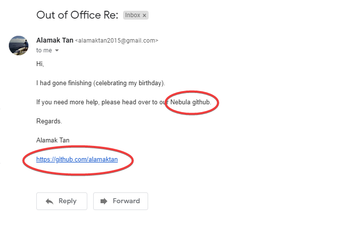
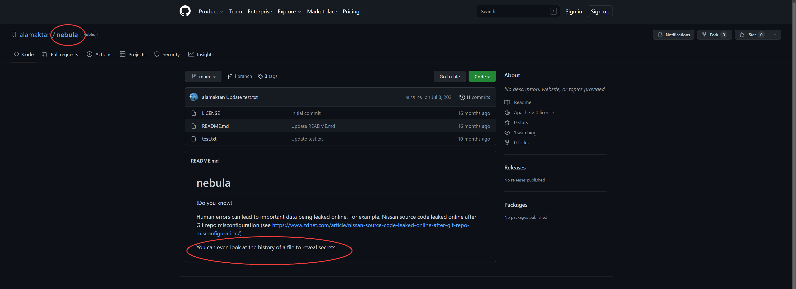
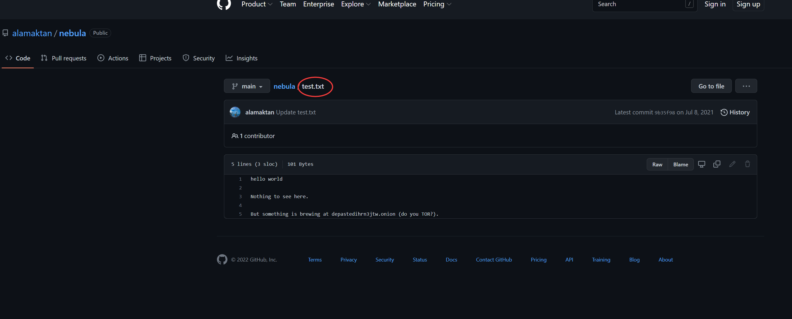
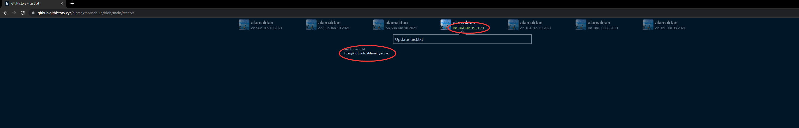

# GitHistory | Difficulty: Easy

## Requirements:

- Using exiftool to extract more metadata information
- Knowledge of githistory (commits history)

---

## Steps:

1. Using `exiftool`

    ```
    $ exiftool alamak.jpg
    ```

    Outputs:

    ```
    ExifTool Version Number         : 11.88
    File Name                       : alamak.jpg
    Directory                       : .
    File Size                       : 929 kB
    File Modification Date/Time     : 2021:08:02 01:31:34+08:00
    File Access Date/Time           : 2022:05:12 12:51:01+08:00
    File Inode Change Date/Time     : 2022:01:10 22:07:35+08:00
    File Permissions                : rwxrwxrwx
    File Type                       : JPEG
    File Type Extension             : jpg
    MIME Type                       : image/jpeg
    JFIF Version                    : 1.01
    Resolution Unit                 : inches
    X Resolution                    : 72
    Y Resolution                    : 72
    Exif Byte Order                 : Little-endian (Intel, II)
    Image Description               : flag@179369
    GPS Version ID                  : 2.2.0.0
    GPS Latitude Ref                : North
    GPS Longitude Ref               : East
    GPS Altitude Ref                : Above Sea Level
    XMP Toolkit                     : Image::ExifTool 10.40
    About                           : uuid:faf5bdd5-ba3d-11da-ad31-d33d75182f1b
    Creator                         : alamaktan2015@gmail.com
    Description                     : Tea@office
    Title                           : Tea@office
    Creator Tool                    : Windows Photo Editor 10.0.10011.16384
    Image Width                     : 3662
    Image Height                    : 2093
    Encoding Process                : Baseline DCT, Huffman coding
    Bits Per Sample                 : 8
    Color Components                : 3
    Y Cb Cr Sub Sampling            : YCbCr4:2:0 (2 2)
    Image Size                      : 3662x2093
    Megapixels                      : 7.7
    GPS Altitude                    : 0 m Above Sea Level
    GPS Latitude                    : 1 deg 17' 26.14" N
    GPS Longitude                   : 103 deg 50' 53.28" E
    ```

    Notice that there is an email at `Creator` tag of the file.

2. Try emailing the `email: alamaktan2015@gmail.com`

    You will recieve an auto reply from the email.

    

    Follow the `github` link found in the email.

        https://github.com/alamaktan

3. Head over to `Nebula` repository.

    

    We are prompted to view the githistory for this repo.

    Our main point of interest is the `test.txt` file found in the repo.

    

4. View the `history` for the file test.txt.

    We can view the commit history directly from the current webpage but it is easier to view it through `https://github.githistory.xyz/`.

    To use githistory.xyz, replace the `github.com` from the current webpage url with `github.githistory.xyz`

    In our case,

        https://github.com/alamaktan/nebula/blob/main/test.txt

        becomes

        https://github.githistory.xyz/alamaktan/nebula/blob/main/test.txt

5. Scroll through the commits and see if you can find the flag.

    The flag can be found in the fourth ever commit made.

    