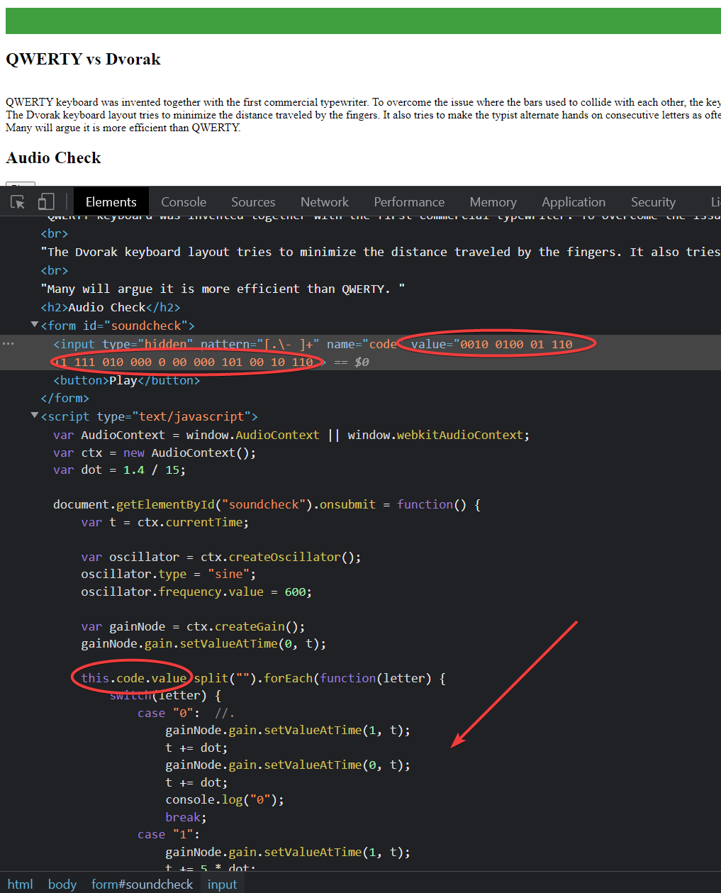
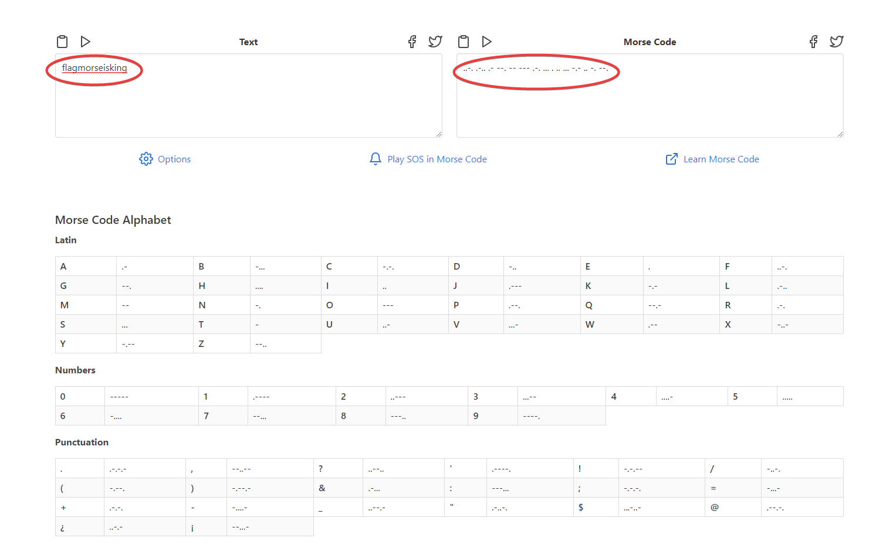

# HtmlView | Difficulty: Medium

## Requirements:

- Know how to read a page source code
    - Base understanding of HTML and JS
- Some knowledge of Morse code (can be googled)

---

## Steps:

1. Press the `Play` button found on the page.

    You should hear some beeps that resemble morse code.

2. View the `page source`.

    After some digging you should see a code with `1`s and `0`s as well as a function that converts that into an audio.

    

    The code is:
    
        0010 0100 01 110 11 111 010 000 0 00 000 101 00 10 110
    
3. I will be using `Python` to convert this code into `Morse code`.

    ```
    code = "0010 0100 01 110 11 111 010 000 0 00 000 101 00 10 110"

    morse_code = ""

    for char in code:
        if char == '0':
            morse_code += '.'
        elif char == '1':
            morse_code += '-'
        elif char == ' ':
            morse_code += ' '

    print(morse_code)
    ```

    The output is:

        ..-. .-.. .- --. -- --- .-. ... . .. ... -.- .. -. --.

4. Using a morse code translator/decoder.

    

    You can also choose to manually decode it yourself using the `Morse Code Alphabet`.

    **DON'T FORGET**: The flag format is flag@XXXXXX, so you will have insert the `@` into the flag.

        flag@morseisking
        
