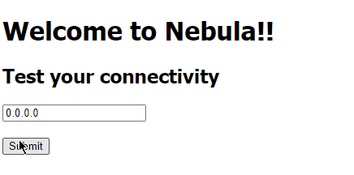
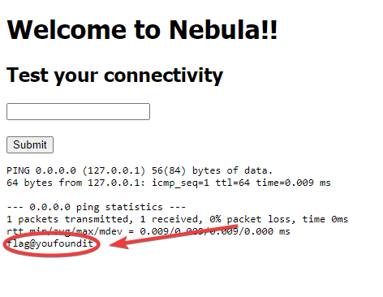

# InputInjection | Difficulty: Easy

## Requirements:

- Basic knowledge of Linux commands e.g. ping, ls, cat
- Basic knowledge of how input is handled (poorly) for Web Development


---

## Steps:
1. Try pinging `0.0.0.0` and see what is displayed.

    

    

2. Realize how the input is being used.

    ```
    # Psuedo code
    input = Input()

    # In some terminal enviroment
    $ ping input
    ```

3. Exploit the unsanitized input.

    ```
    # Psuedo code
    $ ping input

    # We can end the ip command and use our own commands after that

    input = 0.0.0.0; ls 

    $ ping input --> ping 0.0.0.0; ls
    ```

    `ls` is a linux command to  list directories. It will list all contents of the directory.

4. Enter `0.0.0.0; ls` and see what is displayed.

    

5. Use `cat` to view the contents of the flag.txt file.

    Enter `0.0.0.0; cat flag.txt` and view what is displayed.

    

    `cat` is a linux command to print the contents of a file onto the standard output stream.