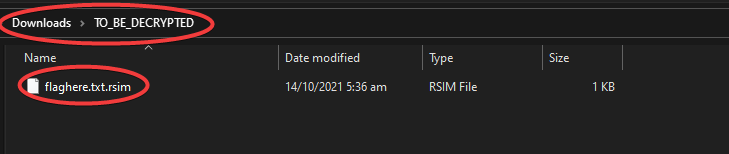
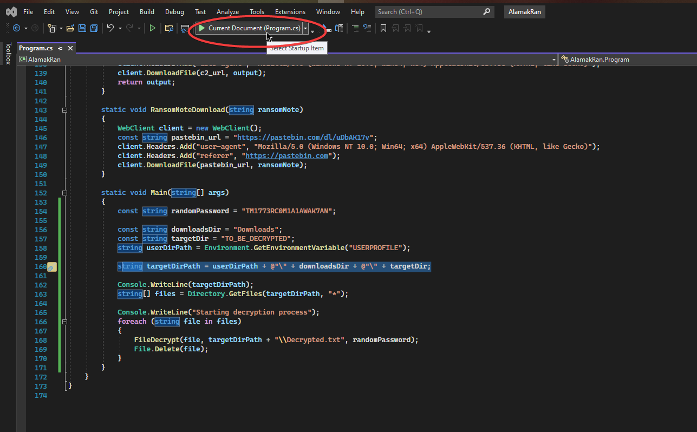
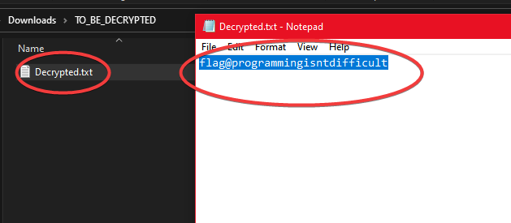

# RansomwareDecryption | Difficulty: Hard

## Requirements:

- Basic knowledge of C# snytax (enough to understand)
- A sharp eye to locate the random password

---

## Steps:

1. Clone the project `AlamakRan` from [Github](https://github.com/alamaktan/AlamakRan).

```bash
$ git clone https://github.com/alamaktan/AlamakRan
```

2.  Open the project using Visual Studio

    Install Visual Studio if you don't already have it. Make sure to include support for `C#` during your installation.\
    If you already have VS installed but without C# installed, you can modify the installation. Read more [here](https://docs.microsoft.com/en-us/visualstudio/install/modify-visual-studio?view=vs-2022).

    Open the project by opening the solution file `AlamakRan.sln` and selecting VisualStudio as the program to open it with.

3.  This project contains the source code for Encryption and Decryption of the files.

    From a brief glance, you will realize that you require a password that was used to encrypt the files hence is needed for the decryption.

    You can dig around and test different passwords but is this is the one:

          PASSWORD: TM1773RC0M1A1AWAK7AN

    It can be found in the `random_note.txt` and is also the wallet id (not important).

4.  Open up the file `Program.cs` in the editor.

    Replace the `Main` function with this one

    ```C#
    static void Main(string[] args)
    {
       const string randomPassword = "TM1773RC0M1A1AWAK7AN";

       const string downloadsDir = "Downloads";
       const string targetDir = "TO_BE_DECRYPTED";
       string userDirPath = Environment.GetEnvironmentVariable("USERPROFILE");

       string targetDirPath = userDirPath + @"\" + downloadsDir + @"\" + targetDir;

       Console.WriteLine(targetDirPath);
       string[] files = Directory.GetFiles(targetDirPath, "*");

       Console.WriteLine("Starting decryption process");
       foreach (string file in files)
       {
             FileDecrypt(file, targetDirPath + "\\Decrypted.txt", randomPassword);
             File.Delete(file);
       }
    }
    ```

    This will expect the encrypted file to be found in a folder called `TO_BE_DECRYPTED` in your `Downloads` folder.\
    You can change by editing the variable: `targetDirPath`.

    

5.  Run the edited file.

    Using Visual Studio

    

6.  View the flag

    Assuming that there was no runtime errors,\
    The encrpyted file `flaghere.txt/rsim` found in the folder `TO_BE_DECRYPTED` should be replaced by one called `Decrypted.txt`.

    Open that file and the flag will be shown.

    
