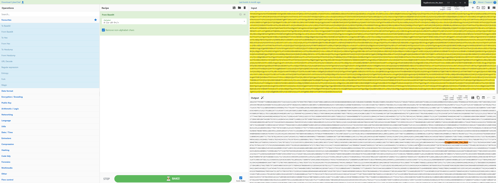

# TypeConversion | Difficulty: Easy

## Requirements:

- Able to recognise Base64 format.

---

## Steps:

1. View the contents of `coded.txt`

   ```
   T1RRMU1qUTFOamsxTnpjNE1qQXpOak13TVRFMU1URXlOVEl5T1RrNU9EQTJPRE14Tm/
   ...many lines later...
   /azNOekF6TXpBMw==
   ```

   You can kind of tell that this is a `Base64 encoded string` since it is a multiple of 4, only consists of [A-Za-z0-9+/] and most recognisably the `==` padding (end of string).

2. Let us decode the contents using a Base64 decoder.

   You may choose to use any decoder you want.\
   I will be using [CyberChef](<https://gchq.github.io/CyberChef/#recipe=From_Base64('A-Za-z0-9%2B/%3D',true)>).

   Results:

   ```
   OTQ1MjQ1Njk1Nzc4MjAzNjMwMTE1MTEyNTIyOTk5ODA2ODMxNjcxMzEzNDc4ODk4OTUyOTYzNDI0NDY2NTM5NjY4NjUxMTU1MjE0NDA2MTYzOTYyMzg4NDI1MzkzNDc0ODQyNzIzMjUyNDEzOTI0NTE5MzgwMjk5NjI5OTkzMjc2ODI4MjY3ODc4MjQ0NTM0OTMwODM0NjczNTM5ODUxOTg3NDUzNTU5NTYyOTU2MzkxMDgyMTg0NzQ2MDM2MTc0ODU2NzM2MTkxOTMyNDMzMjU2OTAzOTM4MzQwNjQ4NTQ1MjkwNTU4ODE0NzA5ODAyOTg0NDM3MTQzNDcyMzk5NzUxOTQ5NzkyMzUyMzM1OTM3MjcyNjg2NjE1NzMxMTg0MDY5MTE2Mjk5MDg5NDYzNDIxMzY2ODg5NTU1NjIzOTE3NDAxNjA4OTYzMjc1ODg5ODI3MDY4NDU0NzM5NzI4NTU2OTk4NzM2MzE5MTI1MTc5NjMwNjYzMzIxNDQ1MzI2MTY5NjIzNzYzNDY3MTEwMzMyNTIxODI1NTA2NzI4NjEwMzM1NTgwMTYyMzkxNzU2MTk3MTIyODc2ODE3OTUzNTYzNDg3OTc5MTk4MzQ4NDU2NjM5MDAzODU5ODAzNzk5MzU0NjQ5MzIxNTgyMzYzODM3MjE4NTU4ODg3NTU0MjcxNDE3NTU2NjIzODgzNTQ4Mjc4MzY4MzE3MTY5ODY3ODExODkzMTU0NjIyOTU3MzYwNjcxODUyMjI5NjgyNTY5OTI3MjAyODg2MjkzNjYwOTU0NTYyMDYwNDIwMjYwNjU0ODk1MjYxMTEzMDQ0MDkxMDU3OTU5MjQwNDM1NDEzNTk5MjI0NjMxMDAzNjg2OTk4OTkyNTQ3MjI3MTk3Nzg2OTQxNjg4ODMwNjk2MzY5Njc0MjgwMzM0NDc5NzM0MTM5NDczODI4OTk3Nzg2NzgzNDY0MTE2NjQ4MTE3NDc5OTU0ODM5OTQ0MDk0NTM1NjgxNzAyMjgyNTE0OTM1MTk5MTI0NDc4OTk2MTU2MTE0Mjc4MzI5MzIyODIzMTE1MTU1OTQwNzA2NzQwMzIyNTE4OTc3ODc4NDAxNDYwOTA3NDQwNzAzNjUzMjQzNDU0Nzc2MTc3MTUwNzI3Mjg4MzYyNzQxNjE5MjE4MDc2NjkwNDQ0NTgzMTgzMzgyOTg1NjE1NTMwMDk5NTcxNTY3NzMxNTI3NzYwNjgwMTY5NTI5NDg1OTY3NDA0ODI3MTY1OTczMTQ0Nzc0NjY4OTcwNzE2NjE1NjU4OTE2NzMyMTU1NjA3NjIzNzc1ODAyMzU4Njk3NDA2OTU2OTk1NzU3NjY5ODYyNDIzMDkyMDk4NDU2MzgyMDkwNzU0NDMxMjc4MDEyODcxNDE5NjQxNTE2ODI3MjIzNjU3NjMzOTIyMTg4MjYyNDk5Mzg3OTM0MjI3NTcwNjk1MDIxOTYxMzYzMzY1MDkzODY5NTQ0NTI0NzcyMjkxOTU0NTk4MTk0MjEyMzI2MjgzMTY1MDQ4MzM1NzY1MjIyNDU3OTc1NzE5MDU1OTExNTUzNjI3NjQ4NzI1Mjg3NTc0MjYzMjU2NDMyMjcyOTY4Mzc5MTE5MTUwODU3MDkxMTgyMjkwOTM0NTU3NTA1NTAxODM5OTk1NDExMjE4NDMxNzExNTM3MzU3Mjg2NDk5ODk3MjQ0Mjk5MTU4Mzc4ODQwMTQ4MzgwOTI2ODAzOTM2NTYyMjgzNjc4ODc4NDQzOTI4MDg5NjI5MTU3MzI2MjIyNDg1ODU0MzE3MTIzNTI1ODc3MzY4OTk0NDM3NjE2MTkxNzc3Nzk3NTY4NjU3NDY1NTQxMzMzMjgwODE2MjI1NTkyMzQ1NjQxNDY2OTg0NzE3MjM2Njg0OTg3MTUzNDUyODA3MjQ3Mzk3MjYwOTM2NzI0MTUzOTQzNzU4OTcwODY4NzkyNDU4NjI0MzgxMzI0MzM1MTU4NTY3NzkzOTU3MDM2MzMyNjQ4Nzg4MTgxNDI0MDc2Njg1MDc1Nzc1NDY1NDI3ODY1ODUyMzgzMjk0Njc1MTE2ODkyODIyNTk3Nzk1OTg3NzE5MDAyODE4NjgxOTkzNzMxNjMxNjIzMTE0OTI3NDc0OTQ3OTkzNzg4NTMzNTQ0NzUwODExODg5MjQyMTk2MzgzODY0Njg2ODY5ODY0MjE4NTM1MDE4NDYzNTY4OTgwMTcwMTYwMjM1ODg5MTM2NDI4NTY3OTE2MTUyNzM4MTgzNzU4NTYxMTQ2OTE4NDc1NTQ4MTIyMTU0NDYxNjkwODI1OTI1NTg0MjEyNDYxNzk1MDQ2MjE2NzY1OTUyNDYxNzQ5NzM0NjM1MDEyMzM0MzI5NTU5NDcwOTIwMzQyOTQ2MDQ3NDM1NDIyODU1MjQyNTEwNzk3MzAyODI1OTEzNjA2NTkxNTg2MzA5NTcyMzA2Njk4NTg4MjQyNTU3Mjk5NTQ4NDI1MTY5ODg3ODM4OTQ0NDE3MTU1Mzg1MzU1ODY3NDI3MzA0OTU1Nzk4MzY4MTM1MTMzMTgyMzkwNTM2MTQxODQxNzg3MzY3NDA5MjgwMjkyNjI2OTE2NDY1OTc4MjI0MjkwNzI3MzExMTc1MTI5NzUyNTM0NzM2ODgxNjY3MTY3OTYyNjI3OTEzNzMxNDM1Nzk2NzMzMjM4MDU2OTQwNDU0Mzk5OTA0Mjc5Mzc3NjE0OTc3OTIyNTgwMTI2NTAxNTY1NjA4OTI5ODg3NjQyOTU5Mjc2MzYzMjMyMDU5Nzk5MDY5OTI2MjA5NTMzNjQ1NTUzMDY4NjQ0NjI3MzM1MTUzMjkwNjc4ODQ2MTQxOTQwNTg1OTkzODQ4MzgwMjg1NTc3NjQ2NjM2NTIzMjM0MDY3Mjg3NzU3MTA4NjI0NTc5NTA4MTA4MDE1MzMxMzU5MTgzNDMzODM1ODA5NDU3MTk2NzU4MDc2MzYzNDg5NTE1MTYyMzc2MTgwMjI2NzMzMTQ1Njk3MzM0NTEwMzU4NjUyMTg4OTc2ODAxMjE0Njg1MjAyNTE4NDM0NjExMzU5NzYxNTg3ODIzODA0ODY3NTA0NzQ2OTk0MzYxNDc1ODA2MTg1NDg5NDk0MTA2NjM2OTAyMTU4MzEyODI3MTc1NzcxNTcyNTY3OTg0MDAzMzU2Mzc4MjUyNDg0NjEyNzU0ODQyNTYzODM2NTc2MzU4MTM4MDk4MzQ1Nzg1NjY1NDg4Mzg4MjUzNTQ4NDg5MTY2Njg1MzkzNTgwOTI5Nzg4MjExNzgzMzE4ODI4ODI5NTQ0ODIwNTE0NjcxMjE3ODk5OTA3NDIyMjY5NDkzMjcwNjIxMzc2OTU1MDY0NjI0NDE2ODMwODU3Njg1NzcwNTkyMTE0NDE0MzQyMDYzMTg4Mzc1NzQzMzU2NDQwMjM5NzIwNzU5NjIwODk0OTg1NjkyNzk3MTIwMzkzNTY1NzcwMTk1MDE0ODQ4MzMzMTI3OTMyNTQzMDcyNDc2NzU0NjkzOTE1OTI4Njk4NTc2OTczMTUyMjMxMjUyMjcwOTM0NzM4Mzc3NzQ0Njc4MDUzNDI0NDQ1MDgyNDY5ODI2NzkyMzQxNzUyOTgxNDE0OTc1OTkyMjE4MjUzNTc5MTUzNjgwNDU0OTk5NTk5NTE4OTU3NTg4MjI1MjI3MzY2NjQ5ODA4ODc2NzUxMjY1NjU1MTIwNDQyMzQ3NjQ0MzE1MDM0NDg5ODM3MjI3MzI3OTE3ODkzNDIxNDE3ODk1MDExMjA4NjU3NTEzMTI0NzMyNjY5MDQ4NzQ0NjgyNDYzNDg3MzExNTg4Njg2MTY4NDM5ODQzMDg2MDc3MjY5ODEyNDIyNzI4NjYzMDkxMDQ3NDQyMDY3OTM1OTMxMTQyMDQ1NDM0MTM5NjA3MTI0ODAxMjE2NzA3MzY4ODc5NjYyNDI0NzU5NzU5NDI1NjY5OTU5NTY4Njg2ODE0OTYxMjQxODI0OTgyNjYyMjQ2NjU5NjExMzIzNjg4ODM0NjM1NDM3NTU0NzkwNDczMjkwMjc2MjMxNzQ3NTE3Mjk0MTEyODg0MzE0NjQxMjk4NzgzOTExNzg5NjgxMjE3NTYzODQ1Nzg4MzI0ODIzNDA0MjUwNTE3MTUyNDA5ODk1ODQ1MDU5NTY2MDE4ODgyOTkxNDA3NjIzOTczNTYxODM5NDU1Mjg0NDQ2NDE3ODQ1OTU1OTM0NTIzMjAyMjMwNjQyMDgxOTUzMTI1MjE0NzY1Nzg2OTExMjE4MTMyNDIwMzY4NjM0ODE4NDc4NjYzNjM0ODc1MDMyNDU0MjIzNjE4NjcwNjA0NzcyNTM5OTkyMzkxMjE1Mzc3ODQ2ODYwMTA2MzE4OTM1ODcxMDA5OTI3MTgzNjIyODEwMDE4ODkxMDA5MTE3NTYyNjc5OTQ1MjE0MTYyMjUyNzk5OTk2Mzg5NTg3MTc0MjI4NjQ4ODcxNTkwNTYzNDQzNDcyOTU2NTc3OTY2NDM2ODMzMTIwMTkxMDA4MDc2MjA2NTIwMzU0MzI5NjgyNDg2NjI5ODg4MjgzMTQyNTYzNTE1MjI3MzYxOTI1OTQ1MzY4MTE2ODc2NDM0OTQzODgzOTY5NjkzNDEyMjg4MjU2MDc5NDQ4Njc1MjUzMjEzMjIyMjA2OTAzMTcwNTYxMzM2MDUwMTAxNDM1Mzk4OTQ4NDA1MjM3NDU5OTU5MTUzNjYxNDM3MzY4NDMwNTI1MjY4OTM5Njg4MTUxMTkxMjIxODY0OTQzOTYxNzc5NDc3ODc0MzU0ODUzMTI1MTkzNzY2OTgzMzc3Njc3Mzc5NDkxNTQ0MzA1MjE3MjQ2Njc2NTgwOTA0Mjg5MTc2MzM5NjA1MTAwMTI5NTczOTc3ODgwOTA3ODc1NTM1Nzg3MTgyMzc0MTgxMjE5NDQzMTc2MTMyMjU1NjQ0OTM2NjI1NjQwMTQ5MzY3ODM3NjkyOTgzMzk2Njc0MTEwMDQ4MTI3Njc4Mjk2OTkyNDU3Njc5NzYzOTY4MjYxMzUzODU4MzE5NzkzMDkyOTg0Njc4Njg2Nzg5NjExODgzOTkxMTI2NjkxODkxOTcyNzU5MzcxMzI2MjA4NjI5NzYzMDUxNjQzOTc4MTUxNDkwNDQyOTc2MjQ3OTI0MjA5Mzk1Nzc0ODQ3MjQ4ODU2MzU4NTgyMDYyNjUxMTgzMjA0NTI2MTUwODc1MzM3OTQ0MjYxMzExMzI0MTgwODA5NTg0Mzg1MTYxNzExNDc5NTU1NDM5NDIyNDkxOTk5NzUxNDEzNTM5NzU4NjI4MzMyNTY5NTQzNDgzODU4MTk4ODg2OTA3MTY5MjQ2NDQ4MDQ4ODQ4MzU2ODkyNjc0Mzk0NTcyNTI0NTM0MjI2NTM5NjU0NDU3NDQ3ODg5NTQ2NTYwODE0MTc5NzY4MTk3OTkwNjQ2NDk2NzE3NjUzNDA3MjgyNjcxMTMxOTc2MTgxMzAzMjMzNDg0ODk4ODQ4NDU4OTIxMjA2NTIxODQ0MTMyOTc3Njg3MzUyODA4OTY2MjMyMzg5MDgzODEzMzIwNzYyNzQ4ODU1OTYxOTk4MDUxNTc0MDM1NTcwMTk4NzIyMTc3OTExNTUxNjU5MTY3OTI2Njg0Mzg1ODc1MzA5MDU5NDMyMDk3NzE3NzY1Nzg3ODIyNDkzNDMzMTk0NzE0NTY0NTM1MTc0MDg1NjQzMDk5OTA5Mjc3OTA2OTg2NTcyNjA4NjQzODc3MjA3OTA1OTkwODAzMjI0NTMzMTc5NjExODUyNDQ1OTE4MzQwNzQ2ODk4MzcyOTU2MjM1Mjk2NzI1NDEyNjk0MTQyNjUxMjk0NjEwMDg3OTg1NjM0MzM0NTY4Nzk4NTY3Mjg4OTY5NTc1ODU3NTQ4MTMzOTY4MDc2NjgzMzU1OTE3MzI1NzgxNDYyODg5MTkwNTYxNjgyMTM2MjY0ODE3MzY4MzE3ODI1NDI1NDM1NTE3OTE1OTc4MzQzMTE4ODk4ODYxNzg1MTc3NjY0NzkxNDkyMTk2MDUyMTMxNzEyNTg4MTAwMzg2MjYyMTk1ODMzNDAyOTkzMDcyODUzNDMxMDk5MTg0NTU3Njc1MzUxNTM4NjU3NTExMDA3MzQ5NjUyOTcxMzYyMjk3NDg4MjYyNjU2MzUyNjMxMDA2NjY3NDUxNDcyNDA4OTE4NjQ1MzE1NTM3OTMxNzY4MTA5Nzk1Mjc1Mzc3MzcxOTc0OTA0ODcwNjExNjc1Njg1OTEzMzY1NDM1MTcyNDE3ODcxODIxNzEzMjMxNjU1OTU1MTI4OTQ1OTYxMzE0NjEyMDkxMzAzMzcyNTQyNzMwNTIyMzY1ODUwNTEzMDYzOTY5MzIxOTYzMzE2NTU4NTE0MzExNDYwMjExMDI3NTU3NjAzNTEwMDEzNjQ0NzQzODgyMzM4MzExNjIzNDUxMDAzNjQ2NDM2Mzc0MjE2MTQxMGZsYWdAd2VsY29tZV90aGVfZGF3bjcwMjc3MjIxNzgyNTY5MjQzOTk2NzE0ODk4NzYxNzk3OTQxMTU5NzM3NTc2NTI5Mjk2OTQ5Njg5MTM5OTU3NzYxOTkxODMyODY5ODY5NDc0NzI3MTc4NjI3NjYxMzMzMTM0MjczMzYyNjkzODg5OTY0NzE0MjcwOTA5NDczNjQ0ODc5NDk5MjIxNzM4NzQ0MzExMTQ1OTk0NDY5MTcyMzM4MzgxMTE3MjI5NjExNDg3MDc4NTU1NDE0OTIyODUwNzcyNjc2NzQ0MzgzNDIxMzQyNTY4ODc0MzU0NTAyNzc5NTQ4MTM4MzU5MTgxNTI3MzA3OTUyOTA5NjY2NzUzODQzODA0MjU0NTU2OTE2NDIwOTA1MzU1ODcxMjg1NTM5MjI0NTQ2ODYyNDA5MzA4MTI2NjUzMDk3OTc3NzI3ODQ0NzI3OTI1NjcyNjI2NDEwMDkyMjE5Mjk2NDI3ODcxMjI1NDU4Mzk2OTI3OTMzMzkyMTYyMjM2NzY4OTk3Nzc2OTcwMjk3NDgxNjUzMDgzNDIxNTI1ODQzMzQxOTI3NzMwMjk3MzExMTgxODgwMjI1OTYzMTc2MTM0MzE1NDkzMTMxMTM0OTQ5ODU2MjI3MTU2NjAzNjI1NTIwMjkyMjg5ODkxNzMzOTkwMTQ4Mjc1NzcyMTg3OTk3NjQ1OTYxODU2ODUzOTE3NTY4MjQ0NDMzNjU2NTUyMTMxODUyODg0MDgwODc3Nzk1NzA1NTM3MTAwOTM1ODg5MzkyMzIwOTM5MTEwMDgxNjQ3MzY5OTYyNzYzMTIyMTA1MDcyOTIyODU4ODg0NTg1ODg4MzY4MjcwMjU0MjY1MTE0MTU0OTU5NDA0MTAwNzI4OTk2ODIxNjI0MTY4NzkzMDgxODkzNjY1Nzc2ODMyOTQ5MzE2MzI5OTMyMzIzNDIzNzcxMjQ2NTYyNDIwNTY2OTc5MzA0NzI1OTE1OTk0NzE1MTM3MjQyNjczODEyMjQyMTg1MjQ4Njg0MjczMzcwNzMzOTI5Mjc1ODQ5MzUwMTgyMDk1MzU5MTk4MjY3Njc1OTIyNDAzOTUwODczOTMzODU1MjM5MjkzMjIzNTM3MzM0NjM0MTc5MDY5NjUyNDY4OTcxMjYxMjkxMDAzOTY3NDk2MjQyMDE3ODczMDg1NTcxNzY0NTU1MjU5NzkxMzY1NDM2OTU3MDQ2NDA1Mjk0NDYzMTgwNTAxODc0NDA5NDc4NzI4NzQzODY4ODMzMTYxNzMxNzI0MTQ1NTUzOTY1OTk1MjU0NjQ1OTUxMTk1MjUyMjIwNDcyMzM1MjIzNzU1OTYxMzk2MTg3MTI0NjMzNzU1MDEwNTY2MjE3NTkxNTY1NjcwNjIxNjQ3MTY4NTk5NTQ3MjY4OTI3MzUxMzI4Njk1Njc0NjY0NTE5MzczODI5MDM0NzA3NTI4NDEyODgxNDI5MTUwOTUxMjI3MTY5NDE5NTgzOTI0MjI1ODkzOTQ2NDEyOTQ2MzgzNDg3MDc5MTQ3MzE0NzUzOTAzMzQ3NTgxMzExMzU0NjQ1OTE1MjkzNjM2Mzg0NTc2MTIwNTYyOTE3Mzg5MDc2NzI0NDUyOTg2MzQ1ODI2NDIzNzQ1OTI3NDM2NjkxMDE0NTI3MTk4NjA5OTE0MTAwNzg0NDc1MzgxNDcwOTQ0NDIyNjkyMjk5OTk1MTEyNjk1Njk2NjMzMTY1NjMxOTY2NzcyNzExMzYxMjIyMTI1MDQ5ODg0MDMwNzUyODk2OTM0OTgwMTE4NzIzNDc1NDQ4MTAwOTU5NzMzMjc3ODk0Mjk0NjE5Njc5MTM5NDM0MjkwNjA4NDk1MzY0Nzc2MDc3NzI3MDU3NDk1Mzg2OTY1NDUxMTc0NjE3ODM5NzM1MTc2MzI2MjQxOTkzNzQzMjkxOTY2NDY0Mjc0NDM0MTM4NDgyNjc3ODQ1MzExMjIzNTQ5NDM5ODEwMDU4MzEwNDI1MDY1ODc1NDkyOTU2MTk3NjMxMzg2Njc3NDc0MTAwNTc5ODY4MjExODU4MTY3MDk3Mjk1MTczMTcyOTYzMTk2MjI5ODQ5NDE2NDgxOTQzODEyNzE3ODY1ODg2NTU5Mjk2ODk2NTI3Mzg0MTAwMzI3NjYyNzg4NTc5NzE0Njk1NDA2NTU2NTkzMjk3Mzc2ODk0MjY3MDY4NjY0OTMyMzI4NTY0MjY1NTg3ODIzMjI3NzMxNjQzMTY5MTMzMjM3MzAxODAxOTQ2ODU3ODY1MTY5Nzg3MzA3MzkxNzcxMTgzMTgyOTIzODE2OTAxNDY1MjQ3NjM1MTk0NTkyNDI0MzQzOTA5OTQzMzA3NjY2OTM5MTY3OTE2NjY4NzY5NjM4Mjg2Mzk4NDM1NjQzOTY2NDg5NTY5OTY4OTE0OTExNDk4NDkwOTQyMTEwNDU1NDU2ODIyNzExNDc0NTQ2NzU1MTM4MTE2MTgzNjMxNzM2Mzc0NDY0MDYzNTA5Mjc0NDU5MDY1NDIxMDM2NjcxNDIxMzczNTIzMTAwNjg1NjQ5NzM3ODY4OTAxNzM3NzE4NjQ5NTU3OTQzNTU0NDM2NjE2ODA5NDc5NzY0MzkxMjY5Njg1MzIzODg0OTAzNjk3NTE2NDkwOTg5ODUzMDk2Mjc0NjgyNzA4NDE1NDQ2ODg1NTY1MzI5NTM0NTI0NTE0NDEwODI2Nzc0MjI0MTQzNDA4NzQ2MzIxOTcwNDg5OTY0Mjc4OTU1NjQ3MjEzODc1Mzc5ODM1OTc4NTM3MjI5OTE2MzU2ODQ2Mjg5NDk0Njg0NTQ4NTgzMDk3MTkyNjc5OTcyOTE1NzM4NDgzNDk5ODk4NTU2ODE2MTcwMTk3MDE5NDg0NDgxMTc2NTE2OTQ2NDM3MzA1MjYxNDY2NDcwOTc3MTU0NDgxMDkyOTk3OTc3MzE0Mzg1ODg1MjUyNjc2NTQ2NjUyMTE0NDU5NTc2ODQ2NTQyMjgzMTc0Mjg1NjE2MjkzNjgxMjQ5MTEzODYxMzUzMjYzNzUwNTEyMjQxMTc5NTE4MzkyMzIwOTEzOTE2MTY5Mzk5NzEzNTQ4MjY2MDgxNDI3NTY3NzU3ODIxNTM0NzU3ODIxNTE0MzE5NTUxNDIyMzM4MjE0NzQzMTQ0Nzc3MTg3NzgyNjM1ODk5Nzg2NzY0NjUxMTE1NTg2MzgzMzcxMjcxMTIyOTMwOTQ3MDE2OTE2NDMxOTg1MTk1OTM4NDM0MzYxODUyNTAzMjc0OTYyNDgxMTk1OTAyODg0MzY4Mzc5OTQyNjIxMTYyMDc4MzA2MzE2OTYxMDA3NjY2MzU0MjkzNTczOTc4NDM5OTQ1MTYzMjI3MTA5NTA2MzgzOTU4OTE1NTA2MDg3OTU2MTY3ODA3Njg4NDUxMjU0OTEzMTg0NzcyMzEyMDY3MTg4MTIyMzkzODc4OTA4NjE1OTUwMjc3MDE3NzY0ODAzNTQzODg2Njk4MjQxMjU3NzU1NTI3NjIxMTM5NjM2NjAzOTY3NjIwOTc4MzI4NTgzNjIzMTAwNDkxMDA0MzgwOTQwMzQxODQxODAzNjg4NzI5MjI4MjUwODU5NDIzNDE2MzgyMzA4Njg1ODY2NzM2MjI0NDc5ODU1NDA4NjM1MDIzOTIyNTIxMTg0OTk3NjUxMTE2MjQwMjI4NDM0NzU4MTUxODM3NTI3NzMxMDkyNjM2ODE3NDAxODQ2MTAzNDE2MjQyNTI2NTQ1NTk0MzM5NTE0NTE3OTI1MjI3NzE1MzEzOTI2MDM3NDQ5NzE1NjA1NjMyNTU0MzgzMTcyOTk3MzE1NTk2NzIxOTY0NjE5MjQ4MTYxNTk3ODMzMzU0OTIyNDY5ODk4ODk0NTUzNzI4ODQ1OTc1Mjk4MTU3MjI4NjcxMDAyODcyNDA3NjIyNTU4MDM0NjgyMjk2NjIzNTg1ODMyNTgzMDc5OTU3MzAzMzEwNDIyNTg3ODUxNTQ3NzYyMzY0NjM2MTgwNDMzNjY2OTMwOTE4NDk3NDA0OTQzMTcxNjQzNDU3NjM0NjMzMTg5Njc0MDUwMjQ5Mjc3MTEyNDgxMzYyNjU5MzY1MDgxOTUxMzUwOTMyMjE1NjExMjk0NzY3MzY4NTY3NjIyNTI5NTczMDkyNzU3Mjg3Njg4NzU2MjY2MjMzMjUxNzUzNTE2Njg5NTQxMTAwNzY3NjgwMzM4NDE2MjU1Mjg2NzEyNDQ1OTgzNDYxNjkxODE5MTIwNzQxOTc2MjMxODg3NzkyMzQ4MTQ0MjY5NjEwMDM3NTcxMzQ2NzcxMjY2NTk0Njc3NTg2MTE1MTExMjI4MjY5ODA5Njk2MTI3NTc0NTkzNzI2OTU4OTQ3ODgxOTU0MjY0ODExMzU1MzA4MDcwMjc1MzcxNDQzNDU1NTc0NTM2NjQ5OTYyNzcyMTAwNzYzMTQxMjIzNjUxNTc5Njc2NzU0MzYwOTQzMzgzNTE4MjczNzkyMTg5NzA1MjM0NDIyNjU1NzY5NDU0NTk2NzM5NTUxNDE4MzU2NjM3ODc3OTU0NTM5MTgwODY2MjI4MzkzODE1ODAzNDEyNDM2NDQwMjQ2MDgzMzYzNzY0MDg1NDAzNjMxMjIxMjU5ODEzODAzMDQ1MTAwNjI1OTk2OTE5NzQ2OTU0NDI1OTI0MjIxOTk4NTkyNTIyMzcxMDg4NjQ4MTU5Mjg3NzcyMzQ2NDA2NTk4MTQyNDI1Njc0OTI4NzU3OTIzODMxOTU0MjY1Njk4NjgyNzkxMzY1MjIzMTczMjYyOTExMDE3NzU2Mzg0NzgyNTY3NTc2Mjc0OTczMTQ1MjU0OTk5NzYyMjEzNTYyMzU3MjQ3MjkxNTI1NjcxNjgxNjIwOTc5MzY3NjE5MjM5NTMzODI1MjcwMzcxOTQ1NTY3NzE5MjU1ODAxMzYyMzgyMDQ2NjU0NDc1OTE5NTQwMjIxNjEyMzkyNjQ0MDU5NzkzNjMxMTEyMTczOTc0MzM3ODA0MTgwNzczMjU2NDEyNDMzNTg5Mjc4NDUxNTY2OTQzNjc2MjM1ODEwMDk2MjQ4NDU4MjgyNTQxMTkyNzY1MzM3NzY0NDQ1OTQ1OTMyMzI5ODEzODY5OTU1NDM3NjkwNTc3OTE2ODU4ODc4NzE5MzUyMTY5NjczODE2OTIzNjA1MjgxNDg3MjQ0NDU5ODc4NjA3OTQ4NDQ2MjQxMTExOTQ0NzEzMjk1NjY3ODI0ODQ2NDAzNTg5MTc1NDc5NDU1NDg0OTM5MDk1MTk5OTY2NjQxNTIyMzU2ODEyMzM2MTE5OTE3MzMzOTIyODY2NDgzNDAxMjc0MTg5MzU3OTk2MjU4OTc1NzI0MzcxODE4Nzk1NDU0Mjc0NzQ4MzIzNTc5NzE2ODQ5ODc0NzMwMjI1NTYxOTU5MDEwMDE3NjYzNzEwNzM0OTQzNTI2MjIxMzgxODYyMzE5NDI5MzUzOTQxMDgyNjE5OTYyMTI1ODI3NzQ0OTg1MDMwNTY4ODc2MjQwMTQ0MzE5MzI4NDk0MTU1Nzc1MTM3MTEzNDY5MjE2OTg1NzM1MTk5NDk0NDY3NTg4ODE3NDkzNzEzNTQ4Njc5NTMzNzQ4ODcxMjE4OTU5Nzc4NDk0NDIwODA1NTk5ODM1NjQ1NDI0NjcxMzQ1NDc3MzE0MjcyNjczNDMzODQ0NTU5NzA1Mjg3NDQyMjk2MTQ1MTkxOTk2NTQ4NzA4MTMxNDI4MDEzNjA4NTQwMzgyMDY1Mjk0NzU2MDUwMTM3NTg1NDg2NTI1MTc0MjI4MjA3MjkyNTU5NTg5MzYxOTMzMjc3MTYzNzU5NTY4MjQ1MzQ5MzcyNzcwNzQ2NzU4NjUyMTI5NTA3ODI4MjU4Njk1MTQ3NzA0NjQwMzIyMjc3NjU1OTg3OTQ4MzAzNDQ4NDY2MzE3MjY0MzIyNjMzMjUyNDk4ODYxODQ4ODQ4NzI3NDEzMTc5NzE0Njc4Mzg0NjkyNDI2OTg2NTkxMzUzMTY2MzI1NzQ1NzE5NDk0OTg0MTI4NzUzMTczNTM5NTgyMDY4MzY0OTQ0NTYxMTAwNDczNjMzMjIwODUyMjE4OTc1NTc0OTc5NDIxMTAwNjA4Mzk5NDUxNjczMzg2ODM1NTIyNDM0NjEwMDYyMzQxMjM5NDg2NTM1NTUxOTE0ODY0NjYxMDQzMTc3Mjc2OTI0MTMxNzc0NjU1NTUxNzE4NzM2NzI0ODY1OTg0Mjk3OTQ5MDg4MTI1MDc2NTY3NDY3NzI0MzI4OTU5NDE3NzQyNjg2NzU4OTYwNDI0NTk4MjU5NTQ1ODE0MzUyMjA4NTY5NTU2MzY1NTg5MTAwNDExOTkzOTEyNzUxNDkyNzUyOTExMTc5MzQxNzIwNDQzNjcxNzc3NzEzMjkxMDA5NzgyMzUwNjI4MTM3ODI3NTk1NjQ2OTkwNDc3MzE5MjI2NDU5MTUxMDYxNTkyODc0ODc0OTc2NjUxODk4NjEzNzcyMzYyODIyMTA5MTU2MzAzNjMxODQ5MjEwMzIyODM1MTQ5MDEyOTk2NDE0OTM2NzgyODUzNjY0NzUyNDUxMTk1NjI4NDQyOTk1OTg5OTc4NTU4NjY0NjA5Njc1MDM0NzkyODM4NzAyMjUzMTU4MTAwOTQzODUxNjE2Mjk2NjQ4NTkwNTc5MDk0ODcxMjM4OTQ4NTk4NTE2MTk1NDg5NTI4Mzg2NzU2Mjk3Mjg4OTM3OTY5NDcxOTYzMzc3ODM0NDc2MDQ4ODA1NTE3ODczODExNDczMTA1MjY2NTk2NTY2Nzc1MjMyMzE1Njk3NzYwMzAyMjg4Mjk0NTY4OTU0Mzk3MDQ4ODkyMjQ4NTY1NjQ1MjA5NjQ3NTI3MDc4Mzc2OTQ4NzEwMDM4OTc1OTc1OTg0ODU2MTQ0ODkyNjk1NTM1MTg2MDI4MjIyODY0Mjc5NzY3NzY5Mjg1Njk0MTI5Njk0MTM5MTY1NDUzMjI2NTI5MjMwMzExOTI3OTEzNDY2NTM1OTg4NjcyNjc1ODE3Nzg3NzA4MzQxNzEwMDU3MTAwODQ3MTIyNDY1MzI5OTI3MjE3NDYyMTYyMjAyNjc1NTQzMjQzNTU0OTIyODIyNDUzODg3NDM1OTg4MDMxOTE5NDMxNTg0NjU2MTQxODgzNzc2Mjc2NzAzOTI0Mzg1MTIzNzI3MjMwOTgyNzIzNjg4NzI1NTk0NjcyOTA1MTQ5MTQ4MTU4MzExNzE1NTU4NTQ4NDMyNzQ5NTIwMTI1OTE2MzA3NjQzNjE4NDc2MTA0NzU3NTc1ODA1NDMyNjU1MDMyNzY1MjU2MTk3Njg2MzI0MDE1MTI2OTUyOTg2OTQxODY5MDkzMzQ4ODQ2OTY3Mzk3NDI0NzU3NDgzNDg4MjQzNjQ1MDEyMjU5NDI2OTQ1ODI3Mzc1Njg3NzU0MTQ0NzcyMjY3NzI1NDQyMzA2ODI5NjIyMjkzNTI5ODQzMzg0MTU3OTQ2OTQ4OTY0MDI3NDkwMTUxMTc0Mjg4MTc3NTA2Mzk0OTY1ODMyOTg2MjM3MjY3Mjk0NjMxNTEwNDQzMDM3OTQ1ODYzNjM0MDc0NjYzODE0NTczNjY1NTU1ODM0ODUyNTcyMjk3Mzg2Mzg1Mjk3MjcxMDc1Njc1MDMzMjU2ODE5ODQyNTUyNjUzNzgzMDY5NzczOTgxNTY5MjYwNTAxMjE5Mzk5MTMwNjA2NjkxMjUzOTk0MDIyMTk5Mjk4MDUyMTQxNDUxNzkzMzMzMzc4MzA2OTY5MDk3MzMyMDIwNTE2MzE2MjM3MTMxNzIyNDI3NTc3OTcxNzc3MjIxMjEyNTIyMTMwNDM4MzQ0OTk3MDc0MzQ4OTczMDMxNjM3NDM1MTEwOTUxODE4NDMzNjc2MzgzOTQ3MTkyMTUxNDMyMjE3NDU2MDczMjg1NjQzMDU3MzgyNTg0NzA1NjE0MDI0OTI5ODU1Mjk4MjUxMTkzMzkyODc3NjYxOTQ3MTYyNTk3Nzc2MDcxNDEyNTYwMTM4OTkwNTMxMTcxMjU2MjQwOTA2MjQxNjEyNzMyMTM0MTU0NDI4MTYyNDkyOTQ4Mjk1ODQyNzcxMzk1MTczODM3MjMyODg2NzA3MjM4MTQ2NTAyMDYyOTc4MTA0MjY4MTQyNzUzNTI1MzcyMjM5MTg3NzgwNjI4NzQ2NDI0MDI5NDkyNzg3MzM4MDU2ODM4MTU1NTY0MzE2MjE4NDMzMzgyNjg4NDE5NDkwMTI1MzM5Mzg4MzE2OTYwODI2NjQzMTY2NDU1NTg5NzA2NDI1MTI3NzkyODAxNTMyNzYyMjg0ODI1ODg1ODE0ODg3MzU4Njc4OTE2NDM0NjUzODEwMzQ2MzcyMjQ2Mjg5ODgzMzc2NjA0NDU5ODY3NTc5MTM3NjY1MDk4Mjc4NTUxOTkxMjEzNDc0NzkzODIzOTQzMjg0NjkyODg5MTEyOTk2MDI3NTg5NTIyNTU5ODE2NDk4NDM4Njc2OTMyMDUwNDU2NjYzNzczMDEwMTY0NjUxMjc2ODMxMTg3Nzg3MDE3NDc2NTUxNTM2NjE0NzkzMDE3NjI3NjkwMDQxMzY1NDUzNjgwNTc4ODIzNjAyNjYyNDM4MzE2ODk0MTE1NjMzMzU1ODU0MzI5NDA0MjQ4NDU3NTgxNjQ3NjM3NzQ2NzE4ODA0MjgxOTQ0MjIxNzU4NDQyODA1NjA3Njk0NjIxNDQyODM1Mzc1MTEyODk1NzQ2MTkyMzg1OTg4ODU3NTMwNjI1NjE3MjUxNDM1Mjg4NjI0NDg3ODAwODkxOTUxNjE2Nzg0MzQ4Njk4ODk3NTY0NTI5MTQ0OTcxNTk5NjYyMzkwMjI4NjI5NjIxNzQ1MDk3NDk5MjYzODIwNDE4MjE1MzYyMjc1NDg5NDk1OTIwMTgyNTI1ODYyNTg5MDI2NjE0MzUyMTcxOTk3MjU1NTQxMTM1NTU3MjkyMTA0NDAyMjIyMTM0NjQ1NzI4ODk2NTg1MzYxNjA3MjMzMjI5OTUyNzI4NjM5NDk3OTkxMzY5NzI4MzQxMDcyNTk4MTAyMjQ5MjgyNzg2ODQwNTQ3NDI2NzI0MTI3OTY3ODMxNTA1NTEyOTE2ODUxMTk3ODkzODU5NzY3MjA0NTEyMjY2MzUzMTMzOTM3MjUxNjI5MTkyMDg4Mjg4OTgxOTQyODExODY5NzQxMTU4NDI4MzY0ODE5Njk0MTYwMzg5ODAyNTk0NzE2NTc1NzI4Njk4MTAzMzEzODQ0MjI0MTIzNjIyMTMzNDUxMTU2ODczMzU5MDE5NTg4NjQ3MTQ2MDk1NTUzMjg0NjIyODUyNDIzODUyNjAyNzM4MzI5MTcxNDEwMzg1MzgzNTc5NTU5Nzc5MTE3Mjk5MTc1MTAzOTEyNTAyNzYzNDA4Mzc2MzI1MTEzODQyMjczOTA2ODk2MDM0OTc4NTE5NjE5MzA4MTczOTg1NzgzMTA4Mjk0NjM4NzMyODg4ODExMjkyOTkxMTA1NTY1Nzc4ODk1ODYzMjY0OTM2ODM5NDEzMzY5ODc3NzgyOTQ1MjEzNTMyMDI3NDM2NTg3ODk2NTM0MjAwODI0NTUyMTcxMjQ1MTE0MjEyMjIyNzQ4Mjk5MzAyMzM3MTg5MjM1MzA1MTg2Mzk5OTc3NTg2NDE0MzE2NzY3MDg0NzMxMzI4MzQ1NjQ1MjY0NDk0ODExNDIzOTI1ODM2OTk5MjczMTI1OTM2MzE1MzMzMzc4NTc4MzEwOTMxOTc0MTAyMTg4Njk0Mzk1MzIyNzU4MTA1MTMxNDQ3MjI4MTE3Mjg0NDA4NTI1NjU1NjExNTQ5MzQ4NDI3NzMwODcxNTEyNDA4NzI3MDYxMjMxNTU0MzI4OTcwODUyMDY1NTM0ODUzOTIzMzgxMjI5ODg5NDA5ODA4NDMyOTg3NzM0NjEyMzQzOTExNjU2NjI0NzAyNjI4MzEzMDA4NzE4MzI1NDUxOTY2NDE4MzQ5NzA4MTcyODI2NTIxMjA1ODQxNjgzNzYyMTEyNDc5NjQxMzA4MTM3NDUyMTI2NTkzNzU0OTA0NzY2NDg4NjMzNDU2MTA3MjM3MTgzNTM4NTg0MDc5NDU2MzY5MTEzNzc2NzQ0MDU1NzgxMjQzNzMxMTMxNDk4NDE5OTQ1ODI1NjM5Mzg3OTE0MDM1OTQ0OTM0OTE5MDE4MjIwMTM4MTk0OTYzMzg4MjQxNzE3NDE5MDgwNzY5NTc3NDc3NzQ1MTIzODIzOTYxODcwNTMxMjI0OTUzNTQ4MzE5NTc5NTE1NzMzMTMyMDQ1ODQyNTEzMzMwOTI2MTI1NjI5ODgwNjkwNjY1OTg4NTE2Mjc0NzAxMzczMzg4Mjk2NjQ2MzgxNzQwMjY0ODE0OTEyMzM2MDI4ODI4OTI5MDcyNDQxODMxNDQ1NDUwMjI4MjIzNjQxNjU4NzgxNTIwNzg4MTE0Mjk5NDAxMTE5MzAzMTY5Nzc1NDQ1NjQxMTExMjEyODMzNTQ3NjgzNTUwNjAyNTcyNzY5NzIyNDczMzkzNDEzNDgzMDM2MjU5NTk5NTA4Mzc0MzQyOTMwNTg4Mjg3MTE3ODk3MzA4MDI3NjQ5NzYwMDI1NzQyNjc4MzE5NDg3NTc2NjI0NDI5MjcyNDk0NTEzNzE1MDIwMjY1NzM1MzU3OTE0NDk2OTI5MjMyMjE1ODE5NDk0MTIxODMzNzIyMjcwNzc1ODQ0NzQ4NTkwODQ0OTkwNzgzMjMwMzMzMzIzNDcyNTQxNDIwNTI3OTM5NzU3NDM3MjM3MTMwMzk1NTE0NDk2MjM1MTIwNzM2NzA2ODY4MTQ0OTAxNTQ3NzQ4NjY3MTM2Njk0MTU3MTQ2OTMzMTc0MzQzMTg5MDQwNzUzMTYwMTc5ODU4MTk2NzMwOTY3ODg1NzY1NDI3NTk5NDIwNDI4MzIzMDQyNjM0NDIxNzEwNzMwMTIyNjMzNzkxNjc1MDg1NjcyODc0ODY5NDY1ODU5NDQ0MTA3Nzg3MzE2ODk3MTE3ODg4MTU4Nzk1NzQ3MjIzMTMzMTg1NTgyNTc5MjAzNzUwNzE4OTI1NDA4NTkxNjQ5OTM1NjU5ODMxNDI1OTkwMjE3NDM4NDk4OTgxNzg5NjU4NjkxNzg5MjUzMDM3OTIxNjA2Nzc3NjI3Njg5OTA4MjY5MjkxMjg2NTgyMjgzNDE5ODA3MjEyMDI0MzgxOTQwOTE5MjU2MjcwNDE1NTM5ODkzNTE4MzkzMTE5NzgzMzM4Nzk5NzkzMzUyMTc5NTY4NzQwNTM5Nzg0NjkzNjM3NjIzMTQ5NDk1MjI1NzYwMzIzODg2NzQ2MTM0NDQ5NjkwMjY3MDk0MTE3NjExOTc1MjkzODQ2MTQyOTMzOTEyODczNzEyMTM1ODg4OTM3Mjk2OTAyNDI1Mjc5NzQ0MTQ1NzU1NTA2MTg1MDgzMjA2ODMxODk1NTcyMDAyMjk2MDgyNzg5NjU2NDQxNjEwNzQ5Njg3NjE1MDI5MjI0MjQ0MjU5MjgzNzkyNDkwNzI4ODYzOTU1MTE4OTI3OTkyMTM5OTg4MzIyMjYzNjcwMjMzNDg0ODk3NDYyMjE3ODMzNjUyMTc4MTg0NDc0NDY2MTI0MTMwMjU4ODk3NzAzMzA3
   ```

3. As you can see, it is still not a readable format.

   I choose to decode the result again as a Base64 string.

   Results:

   ```bash
   9452456957782036301151125229998068316713134788989529634244665396686511552144061639623884253934748427232524139245193802996299932768282678782445349308346735398519874535595629563910821847460361748567361919324332569039383406485452905588147098029844371434723997519497923523359372726866157311840691162990894634213668895556239174016089632758898270684547397285569987363191251796306633214453261696237634671103325218255067286103355801623917561971228768179535634879791983484566390038598037993546493215823638372185588875542714175566238835482783683171698678118931546229573606718522296825699272028862936609545620604202606548952611130440910579592404354135992246310036869989925472271977869416888306963696742803344797341394738289977867834641166481174799548399440945356817022825149351991244789961561142783293228231151559407067403225189778784014609074407036532434547761771507272883627416192180766904445831833829856155300995715677315277606801695294859674048271659731447746689707166156589167321556076237758023586974069569957576698624230920984563820907544312780128714196415168272236576339221882624993879342275706950219613633650938695445247722919545981942123262831650483357652224579757190559115536276487252875742632564322729683791191508570911822909345575055018399954112184317115373572864998972442991583788401483809268039365622836788784439280896291573262224858543171235258773689944376161917777975686574655413332808162255923456414669847172366849871534528072473972609367241539437589708687924586243813243351585677939570363326487881814240766850757754654278658523832946751168928225977959877190028186819937316316231149274749479937885335447508118892421963838646868698642185350184635689801701602358891364285679161527381837585611469184755481221544616908259255842124617950462167659524617497346350123343295594709203429460474354228552425107973028259136065915863095723066985882425572995484251698878389444171553853558674273049557983681351331823905361418417873674092802926269164659782242907273111751297525347368816671679626279137314357967332380569404543999042793776149779225801265015656089298876429592763632320597990699262095336455530686446273351532906788461419405859938483802855776466365232340672877571086245795081080153313591834338358094571967580763634895151623761802267331456973345103586521889768012146852025184346113597615878238048675047469943614758061854894941066369021583128271757715725679840033563782524846127548425638365763581380983457856654883882535484891666853935809297882117833188288295448205146712178999074222694932706213769550646244168308576857705921144143420631883757433564402397207596208949856927971203935657701950148483331279325430724767546939159286985769731522312522709347383777446780534244450824698267923417529814149759922182535791536804549995995189575882252273666498088767512656551204423476443150344898372273279178934214178950112086575131247326690487446824634873115886861684398430860772698124227286630910474420679359311420454341396071248012167073688796624247597594256699595686868149612418249826622466596113236888346354375547904732902762317475172941128843146412987839117896812175638457883248234042505171524098958450595660188829914076239735618394552844464178459559345232022306420819531252147657869112181324203686348184786636348750324542236186706047725399923912153778468601063189358710099271836228100188910091175626799452141622527999963895871742286488715905634434729565779664368331201910080762065203543296824866298882831425635152273619259453681168764349438839696934122882560794486752532132222069031705613360501014353989484052374599591536614373684305252689396881511912218649439617794778743548531251937669833776773794915443052172466765809042891763396051001295739778809078755357871823741812194431761322556449366256401493678376929833966741100481276782969924576797639682613538583197930929846786867896118839911266918919727593713262086297630516439781514904429762479242093957748472488563585820626511832045261508753379442613113241808095843851617114795554394224919997514135397586283325695434838581988869071692464480488483568926743945725245342265396544574478895465608141797681979906464967176534072826711319761813032334848988484589212065218441329776873528089662323890838133207627488559619980515740355701987221779115516591679266843858753090594320977177657878224934331947145645351740856430999092779069865726086438772079059908032245331796118524459183407468983729562352967254126941426512946100879856343345687985672889695758575481339680766833559173257814628891905616821362648173683178254254355179159783431188988617851776647914921960521317125881003862621958334029930728534310991845576753515386575110073496529713622974882626563526310066674514724089186453155379317681097952753773719749048706116756859133654351724178718217132316559551289459613146120913033725427305223658505130639693219633165585143114602110275576035100136447438823383116234510036464363742161410flag@welcome_the_dawn70277221782569243996714898761797941159737576529296949689139957761991832869869474727178627661333134273362693889964714270909473644879499221738744311145994469172338381117229611487078555414922850772676744383421342568874354502779548138359181527307952909666753843804254556916420905355871285539224546862409308126653097977727844727925672626410092219296427871225458396927933392162236768997776970297481653083421525843341927730297311181880225963176134315493131134949856227156603625520292289891733990148275772187997645961856853917568244433656552131852884080877795705537100935889392320939110081647369962763122105072922858884585888368270254265114154959404100728996821624168793081893665776832949316329932323423771246562420566979304725915994715137242673812242185248684273370733929275849350182095359198267675922403950873933855239293223537334634179069652468971261291003967496242017873085571764555259791365436957046405294463180501874409478728743868833161731724145553965995254645951195252220472335223755961396187124633755010566217591565670621647168599547268927351328695674664519373829034707528412881429150951227169419583924225893946412946383487079147314753903347581311354645915293636384576120562917389076724452986345826423745927436691014527198609914100784475381470944422692299995112695696633165631966772711361222125049884030752896934980118723475448100959733277894294619679139434290608495364776077727057495386965451174617839735176326241993743291966464274434138482677845311223549439810058310425065875492956197631386677474100579868211858167097295173172963196229849416481943812717865886559296896527384100327662788579714695406556593297376894267068664932328564265587823227731643169133237301801946857865169787307391771183182923816901465247635194592424343909943307666939167916668769638286398435643966489569968914911498490942110455456822711474546755138116183631736374464063509274459065421036671421373523100685649737868901737718649557943554436616809479764391269685323884903697516490989853096274682708415446885565329534524514410826774224143408746321970489964278955647213875379835978537229916356846289494684548583097192679972915738483499898556816170197019484481176516946437305261466470977154481092997977314385885252676546652114459576846542283174285616293681249113861353263750512241179518392320913916169399713548266081427567757821534757821514319551422338214743144777187782635899786764651115586383371271122930947016916431985195938434361852503274962481195902884368379942621162078306316961007666354293573978439945163227109506383958915506087956167807688451254913184772312067188122393878908615950277017764803543886698241257755527621139636603967620978328583623100491004380940341841803688729228250859423416382308685866736224479855408635023922521184997651116240228434758151837527731092636817401846103416242526545594339514517925227715313926037449715605632554383172997315596721964619248161597833354922469898894553728845975298157228671002872407622558034682296623585832583079957303310422587851547762364636180433666930918497404943171643457634633189674050249277112481362659365081951350932215611294767368567622529573092757287688756266233251753516689541100767680338416255286712445983461691819120741976231887792348144269610037571346771266594677586115111228269809696127574593726958947881954264811355308070275371443455574536649962772100763141223651579676754360943383518273792189705234422655769454596739551418356637877954539180866228393815803412436440246083363764085403631221259813803045100625996919746954425924221998592522371088648159287772346406598142425674928757923831954265698682791365223173262911017756384782567576274973145254999762213562357247291525671681620979367619239533825270371945567719255801362382046654475919540221612392644059793631112173974337804180773256412433589278451566943676235810096248458282541192765337764445945932329813869955437690577916858878719352169673816923605281487244459878607948446241111944713295667824846403589175479455484939095199966641522356812336119917333922866483401274189357996258975724371818795454274748323579716849874730225561959010017663710734943526221381862319429353941082619962125827744985030568876240144319328494155775137113469216985735199494467588817493713548679533748871218959778494420805599835645424671345477314272673433844559705287442296145191996548708131428013608540382065294756050137585486525174228207292559589361933277163759568245349372770746758652129507828258695147704640322277655987948303448466317264322633252498861848848727413179714678384692426986591353166325745719494984128753173539582068364944561100473633220852218975574979421100608399451673386835522434610062341239486535551914864661043177276924131774655551718736724865984297949088125076567467724328959417742686758960424598259545814352208569556365589100411993912751492752911179341720443671777713291009782350628137827595646990477319226459151061592874874976651898613772362822109156303631849210322835149012996414936782853664752451195628442995989978558664609675034792838702253158100943851616296648590579094871238948598516195489528386756297288937969471963377834476048805517873811473105266596566775232315697760302288294568954397048892248565645209647527078376948710038975975984856144892695535186028222864279767769285694129694139165453226529230311927913466535988672675817787708341710057100847122465329927217462162202675543243554922822453887435988031919431584656141883776276703924385123727230982723688725594672905149148158311715558548432749520125916307643618476104757575805432655032765256197686324015126952986941869093348846967397424757483488243645012259426945827375687754144772267725442306829622293529843384157946948964027490151174288177506394965832986237267294631510443037945863634074663814573665555834852572297386385297271075675033256819842552653783069773981569260501219399130606691253994022199298052141451793333378306969097332020516316237131722427577971777221212522130438344997074348973031637435110951818433676383947192151432217456073285643057382584705614024929855298251193392877661947162597776071412560138990531171256240906241612732134154428162492948295842771395173837232886707238146502062978104268142753525372239187780628746424029492787338056838155564316218433382688419490125339388316960826643166455589706425127792801532762284825885814887358678916434653810346372246289883376604459867579137665098278551991213474793823943284692889112996027589522559816498438676932050456663773010164651276831187787017476551536614793017627690041365453680578823602662438316894115633355854329404248457581647637746718804281944221758442805607694621442835375112895746192385988857530625617251435288624487800891951616784348698897564529144971599662390228629621745097499263820418215362275489495920182525862589026614352171997255541135557292104402222134645728896585361607233229952728639497991369728341072598102249282786840547426724127967831505512916851197893859767204512266353133937251629192088288981942811869741158428364819694160389802594716575728698103313844224123622133451156873359019588647146095553284622852423852602738329171410385383579559779117299175103912502763408376325113842273906896034978519619308173985783108294638732888811292991105565778895863264936839413369877782945213532027436587896534200824552171245114212222748299302337189235305186399977586414316767084731328345645264494811423925836999273125936315333378578310931974102188694395322758105131447228117284408525655611549348427730871512408727061231554328970852065534853923381229889409808432987734612343911656624702628313008718325451966418349708172826521205841683762112479641308137452126593754904766488633456107237183538584079456369113776744055781243731131498419945825639387914035944934919018220138194963388241717419080769577477745123823961870531224953548319579515733132045842513330926125629880690665988516274701373388296646381740264814912336028828929072441831445450228223641658781520788114299401119303169775445641111212833547683550602572769722473393413483036259599508374342930588287117897308027649760025742678319487576624429272494513715020265735357914496929232215819494121833722270775844748590844990783230333323472541420527939757437237130395514496235120736706868144901547748667136694157146933174343189040753160179858196730967885765427599420428323042634421710730122633791675085672874869465859444107787316897117888158795747223133185582579203750718925408591649935659831425990217438498981789658691789253037921606777627689908269291286582283419807212024381940919256270415539893518393119783338799793352179568740539784693637623149495225760323886746134449690267094117611975293846142933912873712135888937296902425279744145755506185083206831895572002296082789656441610749687615029224244259283792490728863955118927992139988322263670233484897462217833652178184474466124130258897703307
   ```

   Just like that we have found our flag (you have to Ctrl + F to search for it).

   
